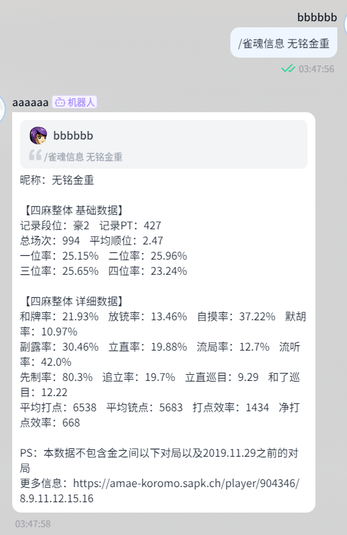
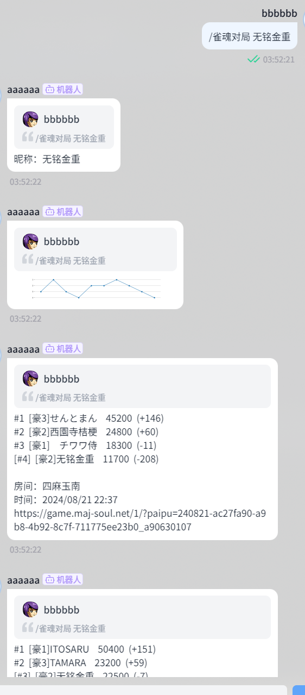
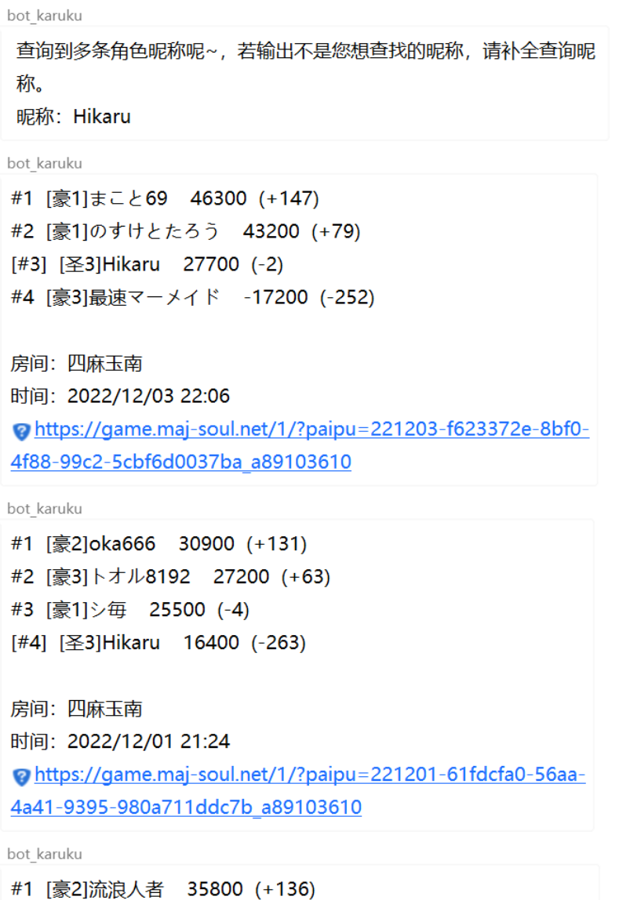
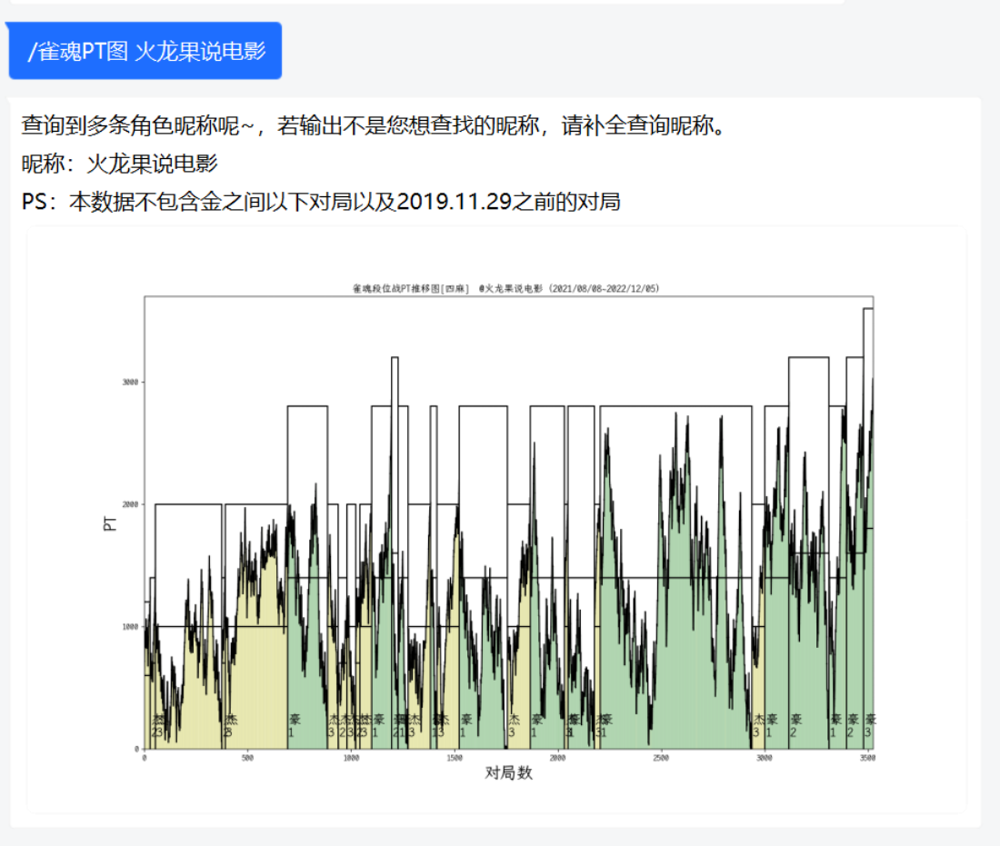
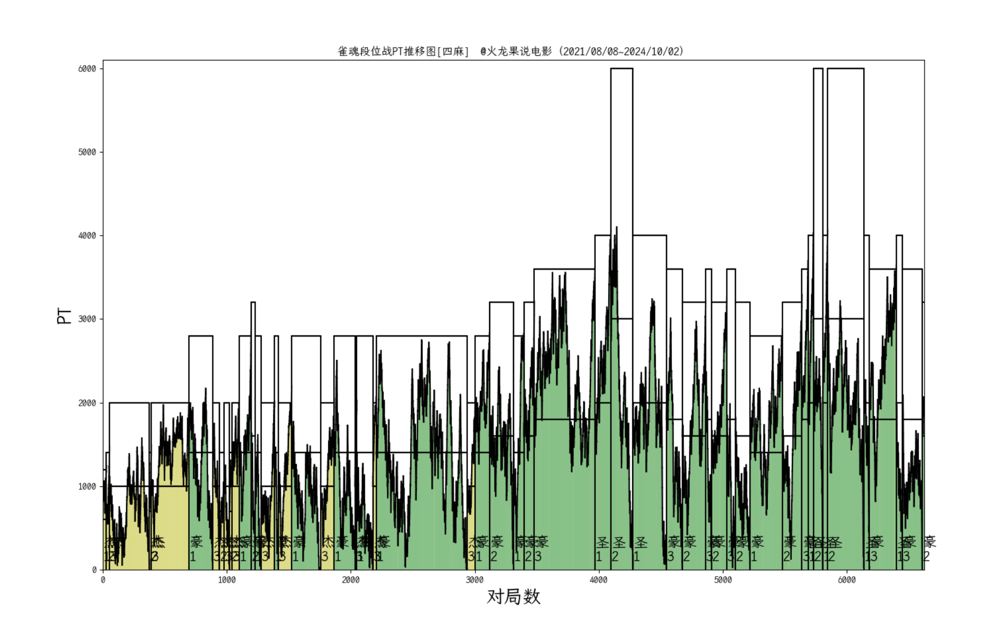

<!-- markdownlint-disable MD033 MD036 MD041 -->

  

nonebot-plugin-majsoul
============

_✨ 雀魂信息查询插件 ✨_

  
  
  

受[DaiShengSheng/Majsoul_bot](https://github.com/DaiShengSheng/Majsoul_bot)启发而写的雀魂信息查询 Bot 插件。

支持适配器：Onebot V11

## 功能

### 雀魂牌谱屋

#### 查询个人数据（可按照时间、按照场数、按照房间类型查询）

指令：`/雀魂(三麻)信息 <雀魂账号> [<房间类型>] [最近<数量>场] [最近<数量>{天|周|个月|年}]`

#### 查询个人最近对局（可按照房间类型查询）

指令：`/雀魂(三麻)对局 <雀魂账号> [<房间类型>]`

#### 绘制个人PT推移图

**若出现乱码，请参考下文配置字体**

指令：`/雀魂(三麻)PT图 <雀魂账号> [最近<数量>场] [最近<数量>{天|周|个月|年}]`

#### 下载雀魂牌谱

将雀魂牌谱保存为天凤JSON格式。**必须配置雀魂账号与密码。**

指令：`/下载雀魂牌谱 <牌谱链接或UUID>`

## 配置项

### majsoul_query_timeout

指令超时，设置为0则无限制。（单位：秒）

默认值：`0`

### majsoul_font

绘图用的字体

### majsoul_font_path

绘图用的字体文件路径

### majsoul_username

下载牌谱用的雀魂账号邮箱。推荐使用小号。

### majsoul_password

下载牌谱用的雀魂账号密码。推荐使用小号。

## See Also

- [nonebot-plugin-mahjong-utils](https://github.com/ssttkkl/nonebot-plugin-mahjong-utils)：日麻小工具插件。支持手牌分析、番符点数查询。
- [nonebot-plugin-mahjong-scoreboard](https://github.com/ssttkkl/nonebot-plugin-mahjong-scoreboard)
  ：日麻计分器。为面麻群友提供日麻对局分数记录。根据马点进行PT精算，统计PT增减，支持对局与榜单查询与导出。

## 在线乞讨

点击请我打两把maimai

## LICENSE

[AGPLv3](https://raw.githubusercontent.com/ssttkkl/nonebot-plugin-majsoul/master/LICENSE)
